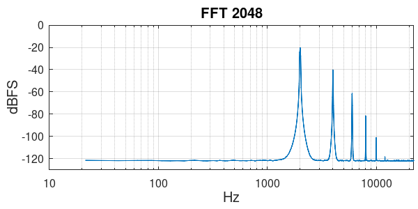
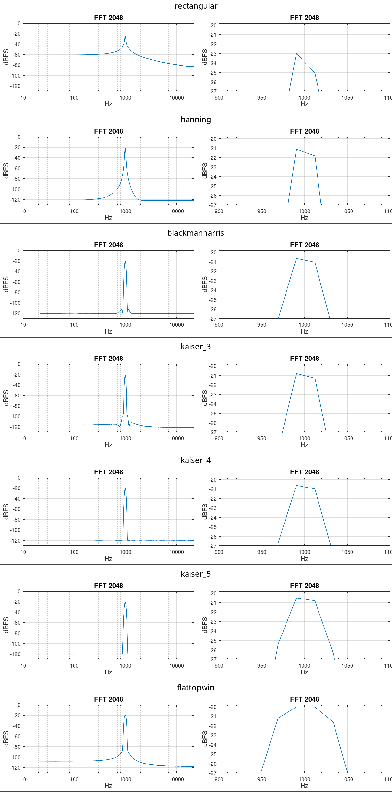
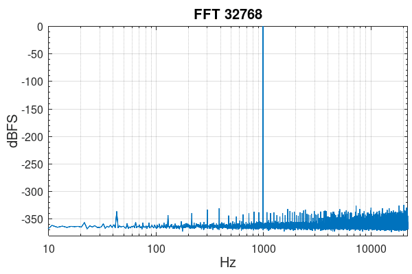
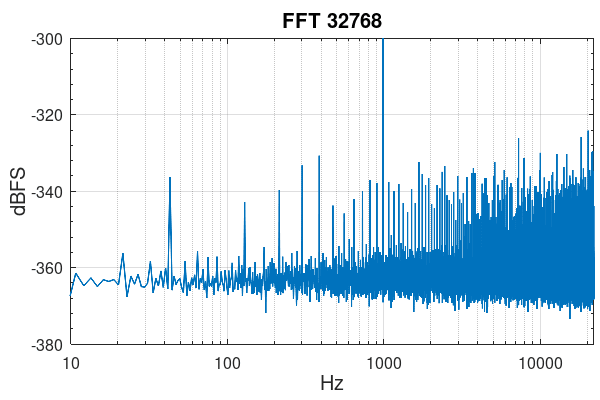

**Table of contents**

<div id="user-content-toc">

* [Intro](#intro)
* [Usage](#usage)
  * [Select a window and overlap](#select-a-window-and-overlap)
  * [Convert to the desired units](#convert-to-the-desired-units)
* [Examples](#examples)

</div>

# Intro

A script for Octave to generate FFT magnitude plot using averaged windowed segments of the signal. It opens the plot window and saves the plot to the PNG file.

Based on [Spectrum and spectral density estimation ...](https://holometer.fnal.gov/GH_FFT.pdf) by G. Heinzel, A. Rüdiger and R. Schilling,

# Usage

There are some variables that can be adjusted. At the beginning:
```
input_file = "audio.wav";
output_file = "spectrum.png";
fft_size = 2 * 1024;
width = 1000;
height = 500;
use_log_frequency_scale = true;
```

In "Select a window and overlap" section you can adjust a window function ([see below](#select-a-window-and-overlap)).

In "Convert to the desired units" section you can adjust units ([see below](#convert-to-the-desired-units)).

Towards the end you can adjust plot properties like title, axes ranges and labels:
```
title(["FFT " num2str(fft_size)]);
ylim([-130 0]);
xlabel("Hz");
ylabel("dBFS");
```

## Select a window and overlap

By default Hanning window is used:
```
win_coef = hanning(fft_size, "periodic");
win_overlap = 0.5;
```
Below are some alternatives. In "Examples" section there are plots showing the differences between them.

Blackman-Harris:
```
win_coef = blackmanharris(fft_size, "periodic");
win_overlap = 0.661;
```
Kaiser:
```
alpha = 3;
win_coef = kaiser(fft_size, pi * alpha);  % optimal overlap: 3 - 0.619, 4 - 0.67, 5 - 0.705
win_overlap = 0.619;
```
Flat-top:
```
win_coef = flattopwin(fft_size, "periodic");  % Almost the same as FTSRS - Stanford Research SR785
win_overlap = 0.754;
```
Rectangular:
```
win_coef = ones(fft_size, 1);
win_overlap = 0;
```
## Convert to the desired units

The initial results are interpreted as power spectrum [V\_rms^2]. By default they are converted to peak linear spectrum:
```
% Convert from power spectrum [V_rms^2] to peak linear spectrum [V_peak]
Y = sqrt(mag2) * sqrt(2);
```
The conversion can be removed if you want power spectrum, or it can be changed to (rms) linear spectrum:
```
% Convert from power spectrum [V_rms^2] to linear spectrum [V_rms]
Y = sqrt(mag2);
```
or linear spectral density:
```
% Convert from power spectrum [V_rms^2] to linear spectral density [V_rms/√Hz]
Y = sqrt(mag2 / enbw);
```
or power spectral density:
```
% Convert from power spectrum [V_rms^2] to power spectral density [V_rms^2/Hz]
Y = mag2 / enbw
```

# Examples

The `testlevels_1.flac` file contains a signal with 6 frequencies at -20, -40, -60, -80, -100 and -120 dBFS. The frequencies are selected so that they end up in the middle of a frequency bin for FFT size of 2048. The `testlevels_2.flac` is similar, only the frequencies are simply 2k, 4k, 6k, 8k, 10k, 12k and they won't be in the middle of a frequency bin.

FFT magnitude of `testlevels_1.flac`:


FFT magnitude of `testlevels_2.flac`:


FFT magnitude of 1 kHz tone at -20 dBFS using different window functions:


The `sin990.f64_44k.wav` file is a WAV file in 64-bit floating-point format. It contains 990.52734375 Hz tone, which ends up in the middle of a frequency bin for FFT sizes of powers of 2. The noise floor is below -300 dBFS but it starts showing the limits of precision.


